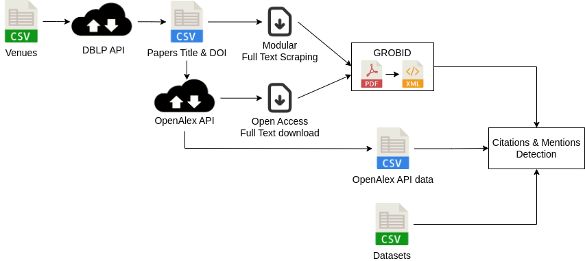

# Citation Needed
This project aims at the quantification of dataset usage in scientific papers. 
The code works as displayed in the following figure:



# Input data
Before starting the different scipts, two files must be filled with information for the venues (venues.csv) and the datasets (datasets.csv).

# Process
The process is divided in 3 parts:

The list of papers from the venues is obtained using the DBLP API. 

Then, the paper DOI (or title if the DOI is not available) is used to query the OpenAlex API to get the following: (i) list of 
referenced papers, (ii) list of words in the abstract, and (iii) open access link to the paper's full text.
The full-text is then fetch using the link from OpenAlex or a custom tool can be added to the process.

The PDF are then convert using GROBID, regex matching are done to detect mentions while matching of OpenAlex ID and regex are used to gather the citations. 

Finally, a notebook provides code to make some figures about the type of presence or the number of citations/mention for a dataset.

# Install & Usage
Clone the repo and install the environment:
```
git clone https://github.com/TheoSourget/Public_Medical_Datasets_References.git
cd Public_Medical_Datasets_References
conda create -n PublicDataset
conda activate PublicDataset
pip install -r requirements.txt
```

Start with the data collection:
```
Get the list of paper from dblp:
python ./Code/data_collection/request_dblp.py

Get informations from OpenAlex:
python ./Code/data_collection/get_papers_info.py

Download fulltext with links from OpenAlex:
python ./Code/data_collection/fulltext_scraper/downloader_OpenAccessPdf.py

Here you can apply your custom scraping tool and add your PDF into Results/extraction/fulltext , you can see an example for PMLR in our repo
```


Than we apply GROBID to convert PDF to XML:
```
With Docker installed, Get GROBID container (you may change the version to have the latest one, see https://hub.docker.com/r/grobid/grobid/tags)
docker pull grobid/grobid:0.8.0

Launch the GROBID container (remember to change the path to grobid.yaml):
docker run -d --rm --init --ulimit core=0 -p 8070:8070 -v /home/theo/grobid/grobid.yaml:/opt/grobid/grobid-home/config/grobid.yaml grobid/grobid:0.8.0

Convert PDF to XML:
python ./Code/grobid/grobid_client_python/convert_pdf.py
```

Then for the usage_detection that will generate the csv of detected mentions and citations:
```
for OpenAlex data:
python ./Code/usage_detection/openalex_detection.py

for grobid:
run grobid_detect.ipynb
```

Finally grobid_oa_analysis.ipynb in ./Code/results_analysis provides examples of figures you can generate with the results obtained before.